内容很基础，因为完全是应对考试用所以既斤斤计较，又一点也不深入。个人归纳方便复习用，侵删

<!-- more -->

### 前置

[c语言vscode环境配置](https://zhuanlan.zhihu.com/p/354400717)
[修改cmd控制台默认代码页编码的几种方法【GBK、UTF-8】](https://blog.csdn.net/qq_39621009/article/details/122817826)utf-8:`chcp 65001` gbk:`chcp 936`

参考资料：
[C 语言教程 - 网道](https://wangdoc.com/clang/)

### 构成

标识符命名规范


常量和变量


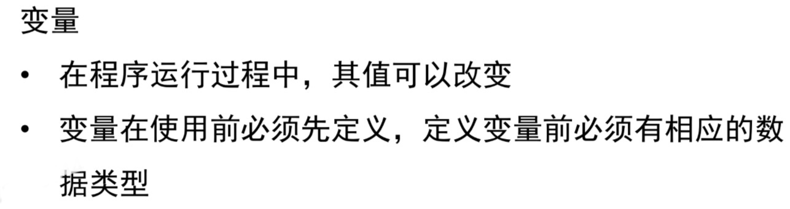

函数


输入输出

```c
#include <stdio.h>/*引用头文件stdio.h；std即standard；
io指输入输出；
.h代表这是头文件；
所有#开头的行表示预编译指令，结尾没有分号*/
void main()
{
    printf("今天是2024年2月17日!\n");
}/*大括号内部叫代码块，可执行语句必须在代码块里面；
void是变量名，不需要返回数据；main(){}指唯一的主函数；
这里使用了头文件中的print()函数*/
```

```c
#include <stdio.h>
int main()
{
int a,b,sum;//声明语句，和下方执行语句两者形成一个函数体
scanf("%d%d",&a,&b);/*输入两个值赋予a和b；
输入时可以用空格隔开后enter，也可以分别输入再enter；
&是取地址符，每个变量都存在指向其内存的地址*/
printf("a = %d,b= %d\n",a,b);//%d套用“,”后的int数据值
sum=a+b;
printf("sum = %d\n",sum);//%d套用“,”后的数据值
return 0;//返回数据“0”
}
```


```c
#include <stdio.h>
int max(int x,int y)
{
    int z;
    if(x > y){
        z = x;
    }else{
        z = y;
    }
    return z;
}//自定义的max方法，处理对象是x,y，结果值为z

int main()
{
    int a,b,c;
    scanf("%d%d",&a,&b);
    printf("第一个数为%d\n",a);
    printf("第二个数为%d\n",b);
    c=max(a,b);//输入两个数据，将a和b交给max函数处理，给c赋予max结果返回值
    printf("更大的数是%d\n",c);
    return 0;
}
```
也可以将自定义的max函数作为头文件单独保存和调用。
```c
//举例max.h和main.c在相同目录下时，max.h的内容：
int max(int x,int y)
{
    int z;
    if(x > y){
        z = x;
    }else{
        z = y;
    }
    return z;
}
```
```c
//main.c内容是：
#include <stdio.h>
#include "./max.h"//"./"省略也没关系
int main()
{
    int a,b,c;
    scanf("%d%d",&a,&b);
    printf("第一个数为%d\n",a);
    printf("第二个数为%d\n",b);
    c=max(a,b);
    printf("更大的数是%d\n",c);
    return 0;
}
//这样结果是一样的
```
注：如果函数的参数是一个变量，那么调用时，传入的是这个变量的值的拷贝，而不是变量本身。可以使用之后的指针来实现


`exit()`函数用来终止整个程序的运行。一旦执行到该函数，程序就会立即结束。该函数的原型定义在头文件`stdlib.h`里面。在main()函数里面，exit()等价于使用return语句。其他函数使用exit()，就是终止整个程序的运行，没有其他作用
```c
// 程序运行成功
// 等同于 exit(0);
exit(EXIT_SUCCESS);

// 程序异常中止
// 等同于 exit(1);
exit(EXIT_FAILURE);
```


全局变量和局部变量


全局变量和局部变量同名时，局部变量优先

### 数据类型和计算

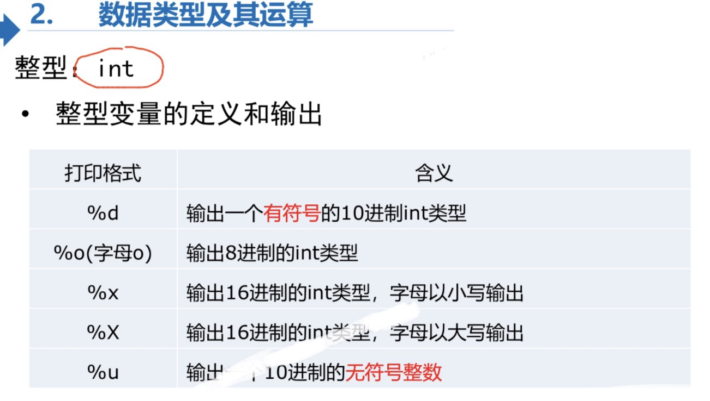

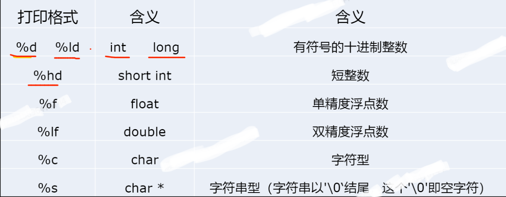
*这里的字符串是个类，c语言没有这种数据。数据在双引号内*
补充：
>%p：指针
%%：输出一个百分号
%u：无符号整数（unsigned int）
%hd：十进制 short int 类型
%g：6个有效数字的浮点数。整数部分一旦超过6位，就会自动转为科学计数法，指数部分的e为小写
%G：等同于%g，唯一的区别是指数部分的E为大写
%#o：显示前缀0的八进制整数
%#x：显示前缀0x的十六进制整数
%#X：显示前缀0X的十六进制整数


*（以上适用于windows）*

signed和unsigned


*char类型本质上就是个整型。存放的其实是个对应字符的ASCII码，所以前面就算有unsigned也不会报错*
[什么是ASCII码，ASCII码值的大小顺序是怎么样 - 知乎](https://zhuanlan.zhihu.com/p/579787917)
常见ASCII码的大小规则：0-9<A-Z<a-z。
几个常见字母的ASCII码大小： “A”为65；“a”为97；“0”为 48。
```c
char c = 'a';
printf("%d",a-32);//A
char c1 ='abc';
    printf("%c",c1);//c 取最后的一个字符（输出取最后，输入取最前）
```

```c
char a = 'B'; // 等同于 char a = 66;
char b = 'C'; // 等同于 char b = 67;

printf("%d\n", a + b); // 输出 133
```

*这四种赋值都是等价的*


```c
printf("%d",1/3);//结果为0
printf("%lf",1/3);//结果为0.000...
/*原因是c语言中整型除以整型还是整型，
1/3结果为0，然后转型成double类型*/
printf("%f",1.0/3)//结果为0.333333...
```

自动类型转换：如应为小数类型的0.998直接给你变成整型的0

强制类型转换：
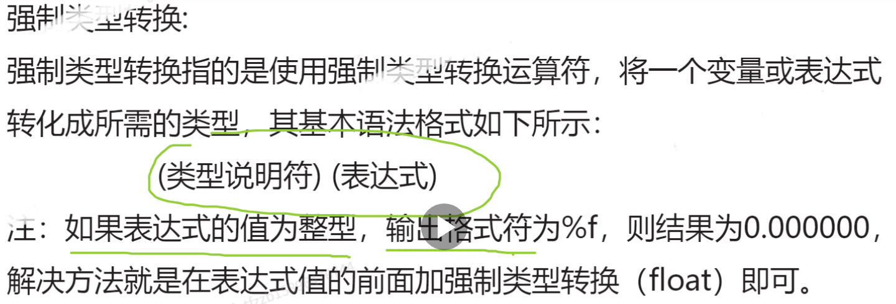
```c
int temp = 3.99f;
printf("%d\n",temp);//3
printf("%f\n",temp);//0.000000
printf("%lf\n",(double)6/3);//2.000000
printf("%f\n",(float)temp);//3.000000
```


sizeof函数
sizeof是 C 语言提供的一个运算符，返回某种数据类型或某个值占用的字节数量。它的参数可以是数据类型的关键字，也可以是变量名或某个具体的值。
```c
printf("%u",sizeof(float));//4
printf("%zd",sizeof(double));//8

int x = sizeof(int);// 参数为数据类型

int i;// 参数为变量
sizeof(i);

sizeof(3.14);// 参数为数值
```


算数运算符
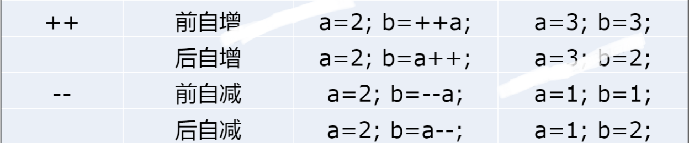
```c
int a = 1;
int b = 2;
++a+b;//a=2,b=2
a+++b;//a=3,b=2
//不存在共用
```

赋值运算符
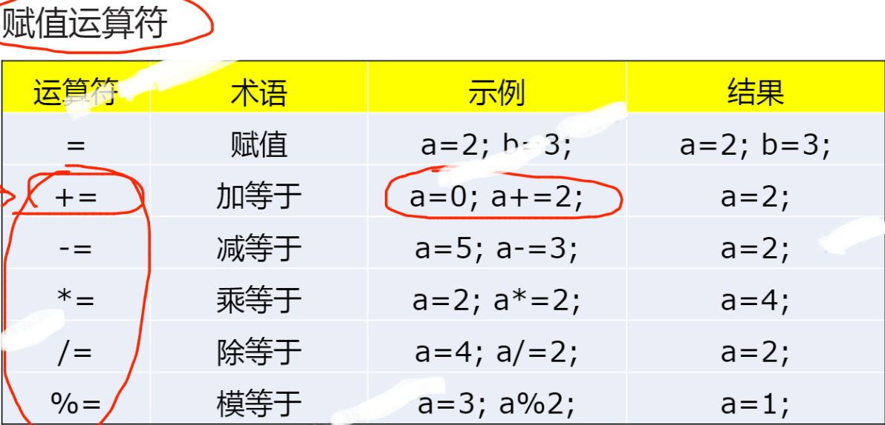

比较运算符/关系运算符
1为真0为假。没有java的布尔类型。
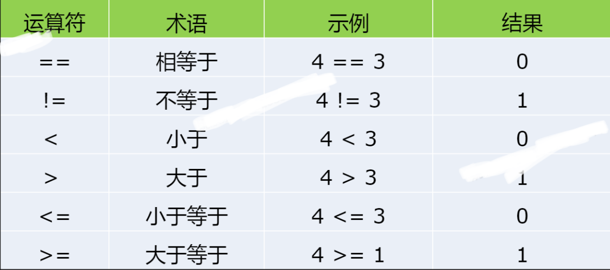

逻辑运算符
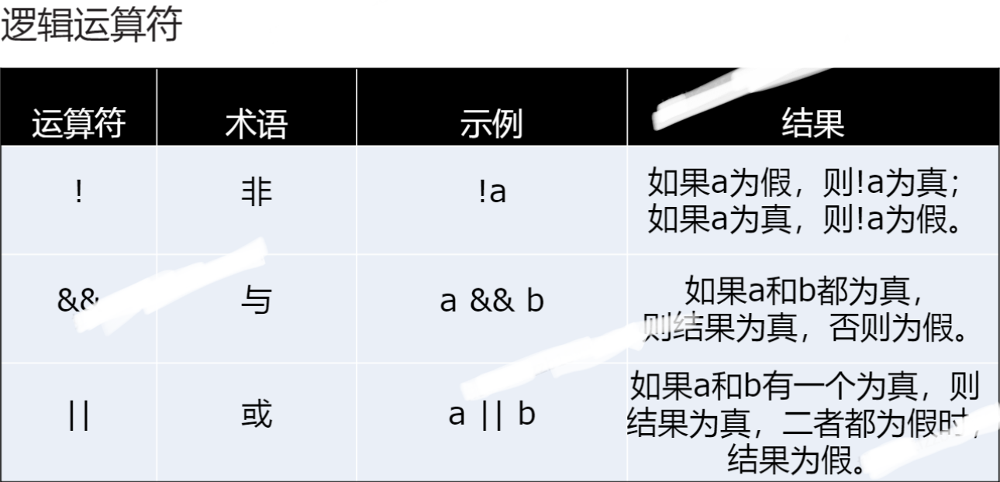

### 基本语句
if-else语句
```c
#include <stdio.h>

int main()
{
    printf("输入你的成绩\n");
    double score;
    scanf("%lf", &score);

    if (score >= 0 && score < 60)//括号中是条件语句
    {
        printf("成绩不合格\n");
    }
    else if (score >= 60 && score <= 100)
    {
        printf("成绩合格\n");
    }
    else
    {
        printf("输入数据有误\n");
    }
    //()内判断真假，真执行{}语句，假执行else后语句
    return 0;
}
```

switch语句

```c
#include <stdio.h>

void main()
{
    char grade;
    scanf("%c",&grade);
    switch(grade)//得是整型（char类型也算）
    {
        case 'A':
        printf("优秀");
        break;//break表示中断，不继续这个代码块的运行
        case 'B':
        printf("良好");
        break;
        case 'C':
        printf("及格");
        break;
        case 'D':
        printf("不及格");
        break;

        default://输入表达式和任意case表达式不符时运行默认内容
        printf("输入数据有误");
        break;
    }
}
```

for循环
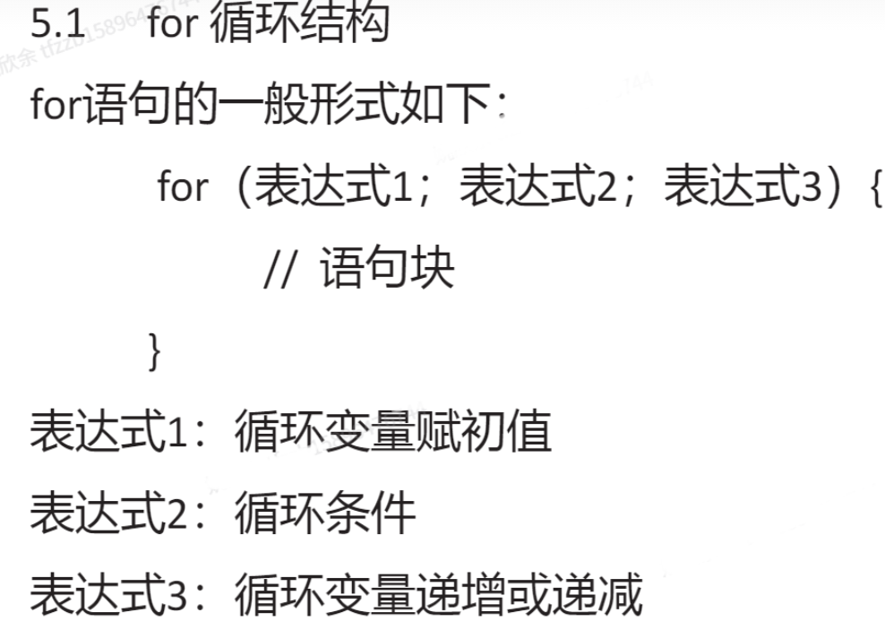
```c
/*计算1到100之和*/
#include <stdio.h>

void main()
{
    int num = 0;
    for(int i = 1;i <= 100;i++)
    {
        num = num + i;
        printf("i=%d\n",i);
        /*可以看出循环执行了100次
        但i的最终值是101，因为最后循环执行之后还会自增，但是已经没有意义
        循环中赋值的i只在循环中有效*/
    }
    printf("结果是%d",num);
}

```

while循环

```c
#include <stdio.h>
//同样可以计算1~100的和
void main()
{
    int sum = 0;
    int i = 100;
    while(i >= 0)
    {
        sum += i;
        i--;
    }
    printf("sum等于%d",sum);
}
//sum等于5050
```

do-while循环
```c
//和while循环的区别是无论如何先运行一次执行语句
#include <stdio.h>
void main()
{
    int i = 10;
    do {
        i--;
    } while(i > 10);

    printf("i等于%d",i);
}
//i等于9
```

练习：控制台输出乘法口诀表
```c
#include <stdio.h>

int main()
{   
    for(int y = 1;y <= 9;y++)
    {
        for(int x = 1;x <= y;x++)
        {
            printf("%d*%d=%d ",x,y,x*y);
        }

        if(y < 9)
        {
            printf("\n");
        }//为防止最后输出多余的一行，单拎出来输出
    }
    return 0;
}
/*
1*1=1 
1*2=2 2*2=4 
1*3=3 2*3=6 3*3=9 
1*4=4 2*4=8 3*4=12 4*4=16 
1*5=5 2*5=10 3*5=15 4*5=20 5*5=25 
1*6=6 2*6=12 3*6=18 4*6=24 5*6=30 6*6=36 
1*7=7 2*7=14 3*7=21 4*7=28 5*7=35 6*7=42 7*7=49 
1*8=8 2*8=16 3*8=24 4*8=32 5*8=40 6*8=48 7*8=56 8*8=64 
1*9=9 2*9=18 3*9=27 4*9=36 5*9=45 6*9=54 7*9=63 8*9=72 9*9=81 
*/
```

continue语句
用于在循环体内部终止本轮循环，进入下一轮循环

```c
#include <stdio.h>

void main()
{
    for(int i = 1;i <= 10;i++)
    {
        if(i % 3 == 0)
        {
            continue;
        }
        printf("%d不是1~10之间的3的倍数\n",i);
    }
}
```

break语句
在switch语句中时,作用是跳出switch结构，执行之后的代码；
在循环语句中，作用是跳出当前内循环语句，执行之后的代码

```c
//计算2到100之间的质数之和
#include <stdio.h>

int main()
{
    int num = 0; // 初始化质数之和
    for (int i = 2; i <= 100;i++) // 遍历2到100之间的数字
    {
        int is_prime = 1; // 假设当前数字是质数
        for (int j = 2; j < i; j++) // 检查当前数字是否能被较小的数字整除
        {
            if (i % j == 0)
            {
                is_prime = 0; // 如果能整除，标记为非质数
                break; // 不需要继续检查，提高效率
            }
        }
        if (is_prime)
        {
            printf("%d是质数\n",i);// 打印每个质数
            num = num + i; // 将质数添加到总和中
        }
    }
    printf("2到100之间的质数之和为：%d\n", num); // 打印质数的总和
    return 0;
}
```

*goto语句
用于跳到指定的标签名。会破坏结构化编程，建议不要轻易使用。也可以用于跳出某个循环*
```c
#include <stdio.h>

void main()
{
    infinite_loop://标签名
  printf("Hello, world!\n");
  goto infinite_loop;
}
//结果为Hello,world\n的无限循环
```

形参和实参


### 指针

指针是一个值，这个值代表有一个内存地址，因此指针相当于指向某内存地址的路标。通过指针，可以简化一些 C 编程任务的执行，还有一些任务，如动态内存分配

字符`*`表示指针，通常跟在类型关键字的后面，表示指针指向的是什么类型的值。比如`char*`表示一个指向字符的指针。

```c
int* intPtr;
int * intPtr;
int *intPtr;
//等效
```
```c
//同时声明两个指针时
// 正确
int * foo, * bar;
// 错误，结果成了foo是整型指针变量，bar是整型变量
int* foo, bar;
```

每一个变量都有一个内存位置，每一个内存位置都定义了可使用`&`运算符访问的地址，它表示了在内存中的一个地址
```c
#include <stdio.h>
 
int main ()
{
    int var_runoob = 10;
    int *p;
    p = &var_runoob;
 
   printf("var_runoob 变量的地址： %p\n", p);
   printf("var_runoob 变量的地址： %p\n",&var_runoob);//等效
   return 0;
}
/*
var_runoob 变量的地址： 000000000061FE14
var_runoob 变量的地址： 000000000061FE14
*/
```


使用指针时会频繁进行以下几个操作：定义一个指针变量、把变量地址赋值给指针、访问指针变量中可用地址的值。这些是通过使用一元运算符 * 来返回位于操作数所指定地址的变量的值
```c
#include <stdio.h>
 
int main ()
{
   int  var = 20;   /* 实际变量的声明 */
   int* ip;        /* 指针变量的声明 */
 
   ip = &var;  /* 在指针变量中存储 var 的地址 */
 
   printf("var 变量的地址: %p\n", &var  );
 
   /* 在指针变量中存储的地址 */
   printf("ip 变量存储的地址: %p\n", ip );
 
   /* 使用指针访问值 */
   printf("*ip 变量的值: %d\n", *ip );
 
   return 0;
}
/*
var 变量的地址: 000000000061FE14
ip 变量存储的地址: 000000000061FE14
*ip 变量的值: 20
*/
```

澄清一下，`p`真的是一个指向、一个指针，是地址而不是地方，对`*p`赋值是对p指向的内存地址存储的值赋值


空指针/NULL指针在C语言中是一个常量，表示地址为0的内存空间，这个地址是无法使用的，读写该地址会报错
```c
#include <stdio.h>
 
int main ()
{
   int  *ptr = NULL;
 
   printf("ptr 的地址是 %p\n", ptr  );
 
   return 0;
}
//ptr 的地址是 0000000000000000
```


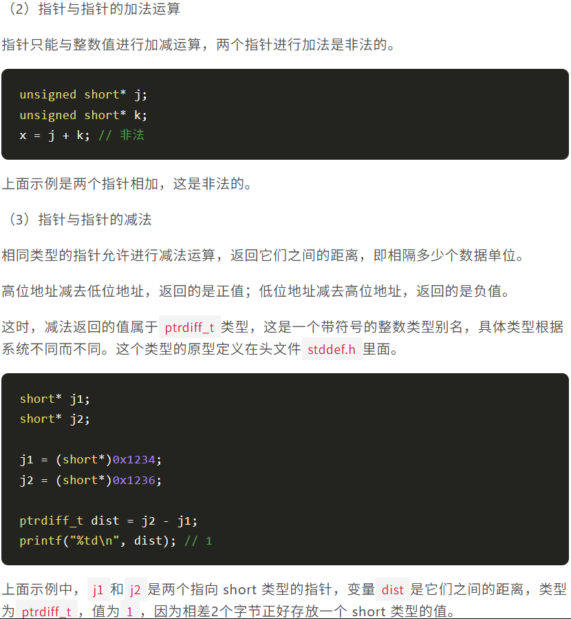


指针的一个用例


函数指针

对于任意函数的五种调用写法：
```c
// 写法一
print(10)
// 写法二
(*print)(10)
// 写法三
(&print)(10)
// 写法四
(*print_ptr)(10)
// 写法五
print_ptr(10)
```

### 数组

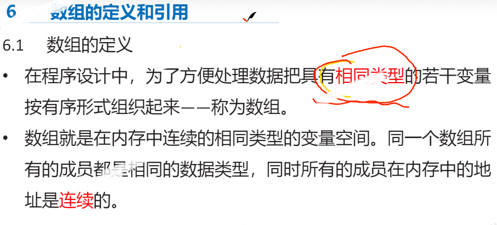


```c
//定义数组
int a[10];//数据类型
char arr[10][9][8];//三维数组
struct Stu boy[10];//构造类型
```

一维数组的初始化
在定义数组的同时进行赋值被称为初始化。全局数组若不进行初始化，编译器将其初始化为0

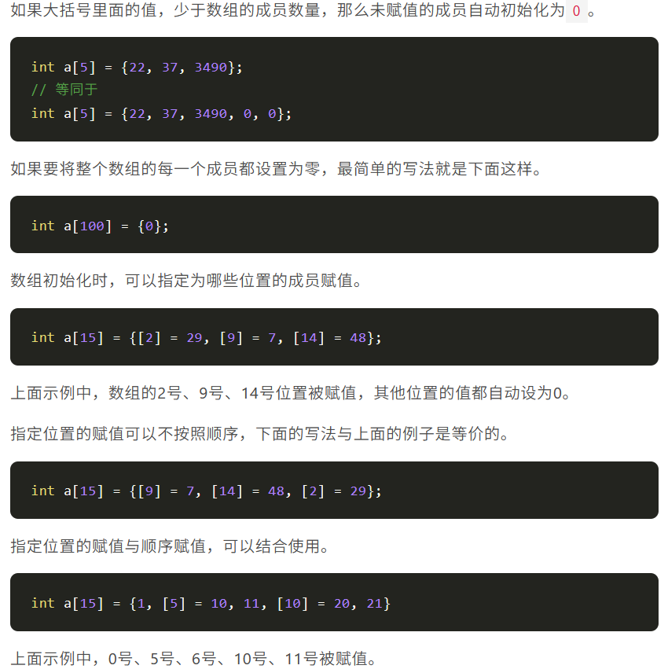


二维数组和多维数组
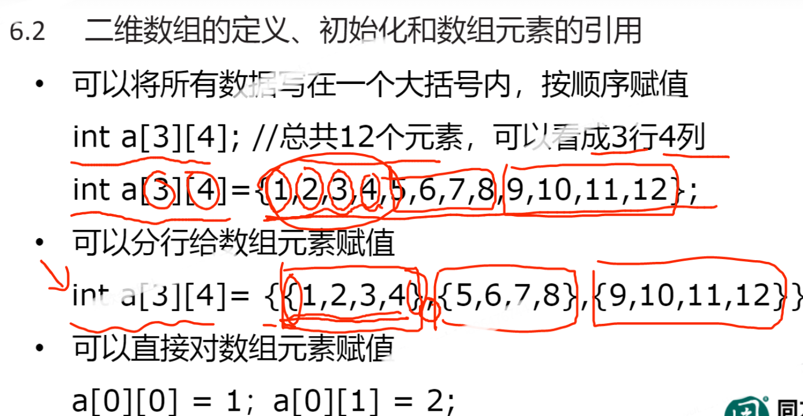


char数组

*利用sizeof()计算元素个数时不要忘记还有个\0*


数组元素的引用
数组名是一个地址的**常量**，代表数组中首个元素的地址
```c
#include <stdio.h>
void main()
{
  int arr[5] = {1,2,3,4,5};
  printf("arr = %p\n",arr);//arr = 000000000061FE00
  printf("&arr[0] = %p\n",&arr[0]);//&arr[0] = 000000000061FE00
  printf("&arr = %p\n",&arr);//&arr = 000000000061FE00
}//这些十六进制数都是内存地址
```

```c
// 写法一
int sum(int arr[], int len);
// 写法二
int sum(int* arr, int len);
```

线性查找

```c
#include <stdio.h>//一个例子

void main(){
  int arr[] = {1,2,3,4,5,6,7};
  int size = sizeof(arr)/sizeof(arr[0]);//求数组长度
  int key = 7;//需要查询的
  int flag = -1;//记号
  
  for(int i = 0;i < size;i++){
    if(key == arr[i]){
      flag = i;
    }
  }
  
  if(flag == -1){
    printf("数组中没有%d这个值",key);
  }else{
    printf("数组中%d这个值的序号是%d",key,flag);
  }
}
```

### *排序二分法及递归算法*

**冒泡排序**
比较相邻的元素。如果第一个比第二个大，就交换他们两个。
对每一对相邻元素作同样的工作，从开始第一对到结尾的最后一对。这步做完后，最后的元素会是最大的数。
针对所有的元素重复以上的步骤，除了最后一个。
持续每次对越来越少的元素重复上面的步骤，直到没有任何一对数字需要比较。

```c
#include <stdio.h>
void bubble_sort(int arr[], int len) {
        int i, j, temp;
        for (i = 0; i < len - 1; i++)
                for (j = 0; j < len - 1 - i; j++)
                        if (arr[j] > arr[j + 1]) {
                                temp = arr[j];
                                arr[j] = arr[j + 1];
                                arr[j + 1] = temp;
                        }
}
int main() {
        int arr[] = { 22, 34, 3, 32, 82, 55, 89, 50, 37, 5, 64, 35, 9, 70 };
        int len = sizeof(arr) / sizeof(arr[0]);
        bubble_sort(arr, len);
        int i;
        for (i = 0; i < len; i++)
                printf("%d ", arr[i]);
        return 0;
}
//3 5 9 22 32 34 35 37 50 55 64 70 82 89 
```
*人话：把最大/最小的拎出去后对剩下的做同样的事*

冒泡排序法效率低，数据规模大时尽量别用

**二分查找**
二分查找（Binary Search）算法，也叫折半查找算法。二分查找的思想非常简单，有点类似分治的思想。二分查找针对的是一个有序的数据集合，每次都通过跟区间的中间元素对比，将待查找的区间缩小为之前的一半，直到找到要查找的元素，或者区间被缩小为 0。

二分查找的过程就像上图一样，如果中间值大于查找值，则往数组的左边继续查找，如果小于查找值则往右边继续查找。二分查找的思想虽然非常简单，但是查找速度非常长，二分查找的时间复杂度为O(logn)。虽然二分查找的时间复杂度为O(logn)但是比很多O(1)的速度都要快，因为O(1)可能标示一个非常大的数值，比例O(1000)。我们来看一张二分查找与遍历查找的效率对比图。

```c
#include <stdio.h>

// 定义 half_find 函数
int half_find(int arr[], int length, int key) {
    int low = 0;
    int high = length - 1;
    int mid = 0;
    
    do {
        mid = (low + high) / 2;
        if (key > arr[mid]) {
            low = mid + 1;
        } else {
            high = mid - 1;
        }
    } while (high >= low && arr[mid] != key);

    if (arr[mid] == key) {
        return mid;
    } else {
        return -1;//元素下标不会是-1.意思就是没找到
    }
}

int main() {
    int arr[] = {1, 3, 5, 7, 9, 11, 13, 15, 17, 19};
    int length = sizeof(arr) / sizeof(arr[0]);
    int target = 11;

    // 使用 half_find 函数查找目标元素的索引
    int index = half_find(arr, length, target);

    if (index != -1) {
        printf("目标元素 %d 在数组中的索引为 %d\n", target, index);
    } else {
        printf("数组中未找到目标元素 %d\n", target);
    }

    return 0;
}
//目标元素 11 在数组中的索引为 5
```